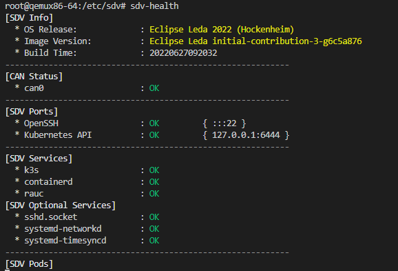
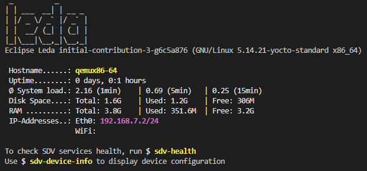

# Leda Core Utilities

The Eclipse Leda core utilities are some some optional utilities and scripts for the runtime. They are considered convenient tools for development and testing purposes. They are pre-installed to the Leda Quickstart images.

List of utilities:

- *sdv-device-info*: Show and update device information
- *sdv-health*: Show SDV software components health status
- *kanto-auto-deployer*: Automatically deploys containers on boot
- *kantui*: A text user interface for kanto-cm to manage containers (start, stop, logs)
- *sdv-motd*: Message-of-the-Day shown after login prompt
- *can-forward*: Forwarding a CAN-bus network interface into a containerized Vehicle Application

# Usage

## SDV Device Info

Synposis: `./sdv-device-info [options] [command]`

Full help:
```
Usage: ./sdv-device-info [options] [command]
Update SDV device configuration information in configuration files.
Example: ./sdv-device-info -v env"

Commands:
 show                 : Display configuration (default command)
 help                 : This message
 version              : Display the SDV software stack versions
 env                  : Format output for use in scripts

Options:
 --ansi | -a      : Don't use colored output.
 --norestart | -n : Do not automatically restart services
 --verbose | -v   : Enable verbose mode.
 --help | -h      : This message.

```

### Display current device information

Display the current device configuration, such as Device ID.

Synposis: `./sdv-device-info show`

### Use device information in scripts

To use device information on other scripts, it may be useful to source the device information variables into the current environment variable context:

Synposis: `source ./sdv-device-info env`

Example:
```
$ source ./sdv-device-info env
$ echo $DEVICE_ID
exampledevice1
```

## SDV Health

The `./sdv-health` utility display a status overview of some important dependencies and device configurations for the SDV stack.
The sdv health utility can be configured using the `sdv.conf` configuration file.

Example output:



## can-forward

Synposis:
```
Usage:  ./can-forward {-h} {-p PID} {-c container} <hw_can>

  hw_can          Host CAN hw interface to forward. Default: can0
  -c container    Attemmpt to get netns PID from a running container: (docker, ctr). Default: seat_service
  -p PID          Use provided PID for transferring vxcan interface (e.g.: docker inspect -f '{{ .State.Pid }}' container)
  -h              Prints this message
```

Example:
```
$ ps -C seat_service -o pid=
$ ./can-forward -p 1234 can0
```

> **Note:** can-forward does currently not support looking up PID of Kubernetes pods.

## Kanto Auto Deployer

Automatically deploys containers to the Kanto Container Management based on deployment descriptors from a given path. All deployment descriptors in the manifests folder will be deployed (created and started) on startup of the service.

Usage as a systemd service (`/lib/systemd/system/kanto-auto-deployer.service`):

```
[Unit]
Description=Kanto Auto Deployer
After=network-online.target container-management.service
Wants=network-online.target container-management.service
Requires=container-management.service

[Install]
WantedBy=multi-user.target

[Service]
Restart=on-failure
RestartSec=5s
ExecStart=/usr/bin/kanto-auto-deployer /var/containers/manifests
```

Example output:
```
root@qemux86-64:/lib/systemd/system# systemctl status kanto-auto-deployer.service 
* kanto-auto-deployer.service - Kanto Auto Deployer
     Loaded: loaded (/lib/systemd/system/kanto-auto-deployer.service; enabled; vendor preset: enabled)
     Active: inactive (dead) since Fri 2022-12-09 09:41:42 UTC; 7min ago
    Process: 472 ExecStart=/usr/bin/kanto-auto-deployer /var/containers/manifests (code=exited, status=0/SUCCESS)
   Main PID: 472 (code=exited, status=0/SUCCESS)

Dec 09 09:41:33 qemux86-64 systemd[1]: Started Kanto Auto Deployer.
Dec 09 09:41:33 qemux86-64 kanto-auto-deployer[472]: Creating [databroker]
Dec 09 09:41:41 qemux86-64 kanto-auto-deployer[472]: Created [databroker]
Dec 09 09:41:41 qemux86-64 kanto-auto-deployer[472]: Starting [databroker]
Dec 09 09:41:42 qemux86-64 kanto-auto-deployer[472]: Started [databroker]
Dec 09 09:41:42 qemux86-64 systemd[1]: kanto-auto-deployer.service: Deactivated successfully.
```

## KantUI

Usage:

    kantui

Keyboard commands:
- Arrow keys `Up` and `Down` to select a container
- Arrow keys `Left` and `Right` to select a column
- `Enter` to change the sort ordering of the currently selected column
- `S` to start the selected container which is currently not running
- `P` to stop the selected container
- `R` to remove a container
- `L` to show the log output of a container
- `Q` to quit kantui

Note: The mouse can be used to select ui items.

Synopsis:
```
kantui 0.1.0
A TUI for Kanto CM that allows easier management of deployed containers. Requires root.

USAGE:
    kantui [OPTIONS]

OPTIONS:
    -h, --help                 Print help information
    -s, --socket <SOCKET>      Set the path to the kanto-cm UNIX socket [default:
                               /run/container-management/container-management.sock]
    -t, --timeout <TIMEOUT>    Time before sending a SIGKILL after a SIGTERM to a container
                               (seconds) [default: 5]
    -V, --version              Print version information
```

## SDV Message of the Day

The `sdv-motd` script provides an alternative motd profile, which displays some additional information after login.

Example output:



# Requirements and installation

The utility scripts currently require `bash`.
The utilities are pre-installed on Eclipse Leda Quickstart distros in the *SDV Full Image* partition.

## Manual installation

- Install bash
- Copy the scripts to the device, e.g. to `/usr/bin/` or to your user's home directory
- Ensure executable bit: `chmod a+x sdv-*`

# Contributing

## Visual Studio DevContainer Setup

- Clone the repository into Visual Studio (`F1` -> `Remote-Containers: Clone repository into volume`)
- Provide the git repository url.

# License and Copyright

Please see [LICENSE](LICENSE)


