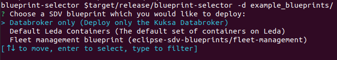

# Blueprint Selector

A Rust application that reads all blueprint files in a directory and provides the user with an
interactive (supports filtering) menu to select the one to be deployed on the edge device via MQTT



The "blueprint" files are desired state messages, that have the extension ".blueprint.json" (configurable) and an additional metadata header (required):
```json
{
  "blueprintMetadata": {
    "name": "<NAME>",
    "description": "<Short Description>"
  },
  "activityId": "correlation-id",
  "timestamp": 1235466
  "payload": {} // This is the desired state message
}
```
The metadata header will be used to construct the list of options presented to the user. You can find example blueprints under the
`example_blueprints` directory in this repository.

The selected blueprint is then published as an MQTT message on the `vehicleupdate/desiredstate` topic.

# CLI options

To get all available configuration options use the `--help/-h` flag:

```shell
$ blueprint-selector --help
A user-friendly tool to select and deploy SDV blueprints

Usage: blueprint-selector [OPTIONS]

Options:
  -d, --blueprints-dir <BLUEPRINTS_DIR>
          The directory containing the SDV bluerprints [default: /var/containers/blueprints]
  -e, --blueprints-ext <BLUEPRINT_EXTENSION>
          Extension to use when iterating over the files in the blueprints directory [default: .blueprint.json]
      --mqtt-broker-host <HOST>
          Hostname/IP to the MQTT broker where the desired state message would be posted [default: 127.0.0.1]
      --mqtt-broker-port <PORT>
          Port for the MQTT broker [default: 1883]
      --mqtt-topic <TOPIC>
          Topic on which to publish the blueprint desired state message [default: vehicleupdate/desiredstate]
  -h, --help
          Print help
  -V, --version
          Print version
```

# Other notes

1. You can set the `DEFAULT_BLUEPRINTS_DIR` environment variable during compilation to change the default blueprints dir
(allows the user to call the blueprint-selector with no argument when the defaults are good).

2. Uses runmqttc as a MQTT (4 only) client, so the binary is completely statically linked (i.e. does not require the user to have paho mqtt)

3. The mqtt-broker-host can be any valid hostname.

# Compiling

To compile the binary in release mode, obtain the [Rust toolchain](https://www.rust-lang.org/tools/install) (version 1.68.2+) and run:

```shell
    $ cargo build --release
```

If you decide to change the default blueprints directory, run:

```shell
    $ DEFAULT_BLUEPRINTS_DIR="/new/default/path" cargo build --release
```

# Running the example

After compiling the binary you can run the selector on the `example_blueprints` directory as so

```shell

  blueprint-selector -d example_blueprints

```