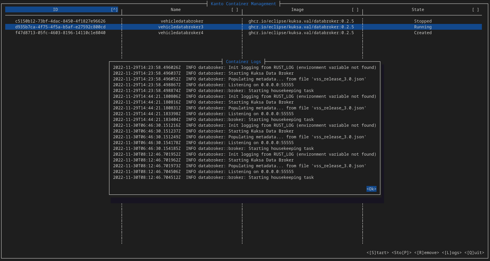

# Kanto Container Management TUI

A simple ncurses-TUI for kanto-cm that allows for easier management of deployed containers. Supports mouse and keyboard interaction. To get started:

```bash
    kantui --help
```



NCurses controls the stdout and cleans up on exit/crash. Thus to capture (if needed) error messages:

```bash
RUST_BACKTRACE=1 kantui 2> stderr.log
```